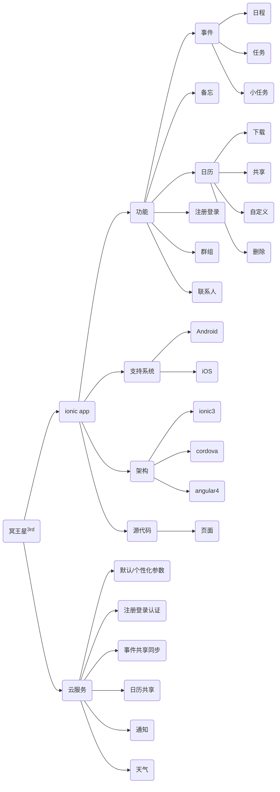

```mermaid
graph LR;
A(冥王星<sup>3rd</sup>) --> B(ionic app);
A --> C(云服务);
B --> BA(功能);
BA --> BAA(事件);
BAA --> BAAA(日程);
BAA --> BAAB(任务);
BAA --> BAAC(小任务);
BA --> BAB(备忘);
BA --> BAC(日历);
BAC --> BACA(下载);
BAC --> BACB(共享);
BAC --> BACC(自定义);
BAC --> BACD(删除);
BA --> BAD(注册登录);
BA --> BAE(群组);
BA --> BAF(联系人);
B --> BB(支持系统);
BB --> BBA(Android);
BB --> BBB(iOS);
B --> BC(架构);
BC --> BCA(ionic3);
BC --> BCB(cordova);
BC --> BCC(angular4);
B --> BD(源代码);
BD --> BDA(页面);
C --> CD(默认/个性化参数);
C --> CA(注册登录认证);
C --> CB(事件共享同步);
C --> CC(日历共享);
C --> CE(通知);
C --> CF(天气);
```

