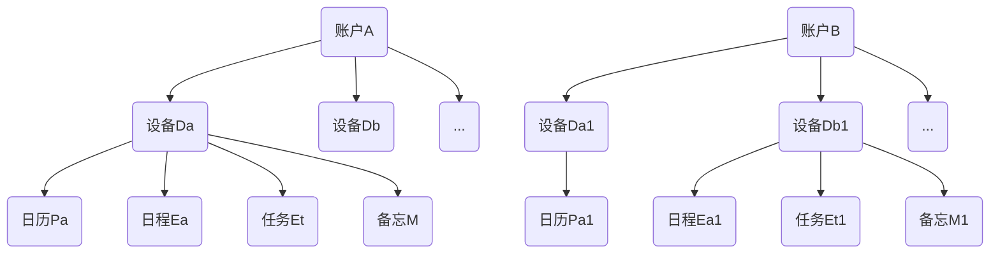
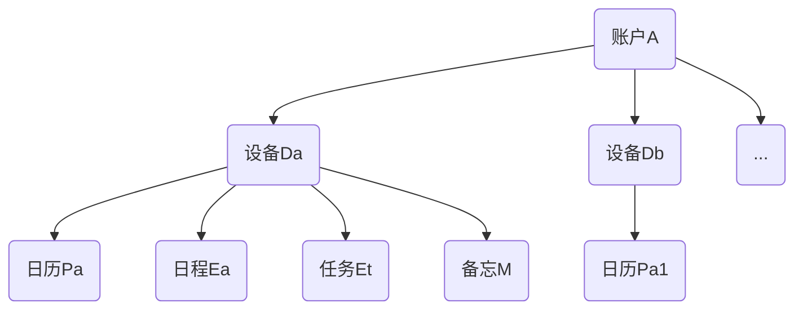
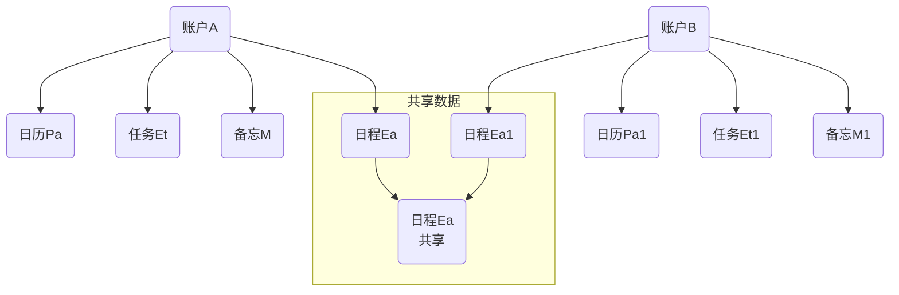

# 数据同步(Data Synchronize)

数据多设备同步, 多账户间共享同步

## 账户/设备/数据结构

## 多设备同步

### 设备间同步只按照(数据类型, 日期, 名称)区别重复

数据ID使用原设备生成的ID, 新设备账户登录可以提示是否同步已存在设备的数据, 可选择设备。
服务器使用元数据ID作为识别唯一ID, 设备间同步在服务器端复制数据后, 由客户端下载, 完成同步。

## 多账户同步

### 账户间同步按照(数据ID)区别重复

多账户共享数据修改同步, 只同步共享数据第一次共享设备, 其它设备同步由多设备同步完成。

## 数据状态枚举
### 日历/计划
| **Plan** |账户A 设备Da|账户A 设备Dx|服务器|账户B 设备Db|
| ---  | ---  | ---  | :--  | ---  |
| | [Plan, **ID1XX1**, ..., 未删除, 已同步] |  | [账户A, 设备Da, Plan, **ID1XX1**, **ID1XX1**, ..., 未删除] |  |
| |  |  | [账户A, 设备Da, Plan, ID1XX2, ID1XX2, ..., 删除] |  |
| |  |  | [账户B, 设备Db, Plan, **ID11X1**, **ID11X1**, ..., 未删除] | [Plan, **ID11X1**, ..., 未删除, 已同步] |
| | [Plan, **ID1XX3**, ..., 未删除, 已同步] |  | [账户A, ***设备Da***, Plan, **ID1XX3**, **ID1XX3**, ..., 未删除] |  |
| |  | [Plan, **ID1XX3**, ..., 未删除, 已同步] | [账户A, ***设备Dx***, Plan, **ID1XX3**, **ID1XX3**, ..., 未删除] |  |
| | [Plan, **ID1XX4**, ..., 未删除, 已同步] |  | [账户A, 设备Da, Plan, **ID1XX4**, **ID1XX4**, ..., 未删除] |  |
| |  |  | [账户B, 设备Db, Plan, ID11X2, ID11X2, **ID1XX4**, ..., 未删除] | [Plan, ID11X2, **ID1XX4**, ..., 未删除, 已同步] |

### 日历项
| PlanItem |账户A 设备Da|账户A 设备Dx|服务器|账户B 设备Db|
| ---  | ---  | ---  | :--  | ---  |
|  | [PlanItem, **ID2XX1**, ..., 未删除, 已同步] |  | [账户A, 设备Da, PlanItem, **ID2XX1**, **ID2XX1**, ..., 未删除] |  |
| |  |  | [账户A, 设备Da, PlanItem, ID2XX2, ID2XX2, ..., 删除] |  |
| |  |  | [账户B, 设备Db, PlanItem, **ID21X1**, **ID21X1**, ..., 未删除] | [PlanItem, **ID21X1**, ..., 未删除, 已同步] |
| | [PlanItem, **ID2XX3**, ..., 未删除, 已同步] |  | [账户A, ***设备Da***, PlanItem, **ID2XX3**, **ID2XX3**, ..., 未删除] |  |
| |  | [PlanItem, **ID2XX3**, ..., 未删除, 已同步] | [账户A, ***设备Dx***, PlanItem, **ID2XX3**, **ID2XX3**, ..., 未删除] |  |

### 任务
| Task |账户A 设备Da|账户A 设备Dx|服务器|账户B 设备Db|
| ---  | ---  | ---  | :--  | ---  |
|  | [Task, **ID3XX1**, ..., 未删除, 已同步] |  | [账户A, 设备Da, Task, **ID3XX1**, **ID3XX1**, ..., 未删除] |  |
| |  |  | [账户A, 设备Da, Task, **ID3XX2**, **ID3XX2**, ..., 删除] |  |
| |  |  | [账户B, 设备Db, Task, **ID31X1**, **ID31X1**, ..., 未删除] | [Task, **ID31X1**, ..., 未删除, 已同步] |
| | [Task, **ID3XX3**, ..., 未删除, 已同步] |  | [账户A, ***设备Da***, Task, **ID3XX3**, **ID3XX3**, ..., 未删除] |  |
| |  | [Task, **ID3XX3**, ..., 未删除, 已同步] | [账户A, ***设备Dx***, Task, **ID3XX3**, **ID3XX3**, ..., 未删除] |  |
| | [Task, **ID3XX4**, ..., 未删除, 已同步] |  | [账户A, 设备Da, Task, **ID3XX4**, **ID3XX4**, ..., 未删除] |  |
| |  |  | [账户B, 设备Db, Task, ID31X2, ID31X2, **ID3XX4**, ..., 未删除] | [Task, ID31X2, **ID3XX4**, ..., 未删除, 已同步] |
| *1 | [Task, **ID3XX5**, ..., 未删除, 未同步] | |  |  |
| *2 | [Task, **ID3XX5**, ..., 未删除, 已同步] | | [账户A, ***设备Da***, Task, **ID3XX5**, **ID3XX5**, ..., 未删除] | |
| *3 |  | | [账户A, ***设备Dx***, Task, **ID3XX5**, **ID3XX5**, ..., 未删除] | |
| *4 |  | [Task, **ID3XX5**, ..., 未删除, 已同步] | [账户A, ***设备Dx***, Task, **ID3XX5**, **ID3XX5**, ..., 未删除] | |
| *1 | [Task, **ID3XX6**, .*., 未删除, 未同步] | | [账户A, 设备Da, Task, **ID3XX6**, **ID3XX6**, ..., 未删除] |  |
|  |  | [Task, **ID3XX6**, ..., 未删除, 已同步] | [账户A, 设备Dx, Task, **ID3XX6**, **ID3XX6**, ..., 未删除] | |
| *2 | [Task, **ID3XX6**, **.*.**, 未删除, 已同步] | | [账户A, 设备Da, Task, **ID3XX6**, **ID3XX6**, **.*.**, 未删除] | |
|  |  | [Task, **ID3XX6**, ..., 未删除, 已同步] | [账户A, 设备Dx, Task, **ID3XX6**, **ID3XX6**, ..., 未删除] | |
| *3 | [Task, **ID3XX6**, **.*.**, 未删除, 已同步] |  | [账户A, 设备Da, Task, **ID3XX6**, **ID3XX6**, **.*.**, 未删除] | |
|  |  | [Task, **ID3XX6**, ..., 未删除, 已同步] | [账户A, 设备Dx, Task, **ID3XX6**, **ID3XX6**, **.*.**, 未删除] | |
| *4 | [Task, **ID3XX6**, **.*.**, 未删除, 已同步] |  | [账户A, 设备Da, Task, **ID3XX6**, **ID3XX6**, **.*.**, 未删除] | |
|  |  | [Task, **ID3XX6**, **.*.**, 未删除, 已同步] | [账户A, 设备Dx, Task, **ID3XX6**, **ID3XX6**, **.*.**, 未删除] | |
| *1 | [Task, **ID3XX7**, ..., 删除, 未同步] | | [账户A, 设备Da, Task, **ID3XX7**, **ID3XX7**, ..., 未删除] |  |
|  |  | [Task, **ID3XX7**, ..., 未删除, 已同步] | [账户A, 设备Dx, Task, **ID3XX7**, **ID3XX7**, ..., 未删除] | |
| *2 |  | | [账户A, 设备Da, Task, **ID3XX7**, **ID3XX7**, ..., 已删除] | |
|  |  | [Task, **ID3XX7**, ..., 未删除, 已同步] | [账户A, 设备Dx, Task, **ID3XX7**, **ID3XX7**, ..., 未删除] | |
| *3 |  |  | [账户A, 设备Da, Task, **ID3XX7**, **ID3XX7**, ..., 已删除] | |
|  |  | [Task, **ID3XX7**, ..., 未删除, 已同步] | [账户A, 设备Dx, Task, **ID3XX7**, **ID3XX7**, ..., 已删除] | |
| *4 |  |  | [账户A, 设备Da, Task, **ID3XX7**, **ID3XX7**, ..., 已删除] | |
|  |  |  | [账户A, 设备Dx, Task, **ID3XX7**, **ID3XX7**, ..., 已删除] | |

### 日程
| Agenda |账户A 设备Da|账户A 设备Dx|服务器|账户B 设备Db|
| ---  | ---  | ---  | :--  | ---  |
|  | [Agenda, ID4XX1, ..., 未删除, 已同步] |  | [账户A, 设备Da, Agenda, ID4XX1, ID4XX1, ..., 未删除] |  |
| |  |  | [账户A, 设备Da, Agenda, ID4XX2, ID4XX2, ..., 删除] |  |
| |  |  | [账户B, 设备Db, Agenda, ID41X1, ID41X1, ..., 未删除] | [Agenda, ID41X1, ..., 未删除, 已同步] |
| | [Agenda, **ID4XX3**, ..., 未删除, 已同步] |  | [账户A, ***设备Da***, Agenda, **ID4XX3**, **ID4XX3**, ..., 未删除] |  |
| |  | [Agenda, **ID4XX3**, ..., 未删除, 已同步] | [账户A, ***设备Dx***, Agenda, **ID4XX3**, **ID4XX3**, ..., 未删除] |  |
| | [Agenda, **ID4XX4**, ..., 未删除, 已同步] |  | [账户A, 设备Da, Agenda, **ID4XX4**, **ID4XX4**, ..., 未删除] |  |
| |  |  | [账户B, 设备Db, Agenda, ID41X2, ID41X2, **ID4XX4**, ..., 未删除] | [Agenda, ID41X2, **ID4XX4**, ..., 未删除, 已同步] |

### 小任务
| MiniTask |账户A 设备Da|账户A 设备Dx|服务器|账户B 设备Db|
| ---  | ---  | ---  | :--  | ---  |
|  | [MiniTask, **ID5XX1**, ..., 未删除, 已同步] |  | [账户A, 设备Da, MiniTask, **ID5XX1**, **ID5XX1**, ..., 未删除] |  |
| |  |  | [账户A, 设备Da, MiniTask, ID5XX2, ID5XX2, ..., 删除] |  |
| |  |  | [账户B, 设备Db, MiniTask, **ID51X1**, **ID51X1**, ..., 未删除] | [MiniTask, **ID51X1**, ..., 未删除, 已同步] |
| | [MiniTask, **ID5XX3**, ..., 未删除, 已同步] |  | [账户A, ***设备Da***, MiniTask, **ID5XX3**, **ID5XX3**, ..., 未删除] |  |
| |  | [MiniTask, **ID5XX3**, ..., 未删除, 已同步] | [账户A, ***设备Dx***, MiniTask, **ID5XX3**, **ID5XX3**, ..., 未删除] |  |
| | [MiniTask, **ID5XX4**, ..., 未删除, 已同步] |  | [账户A, 设备Da, MiniTask, **ID5XX4**, **ID5XX4**, ..., 未删除] |  |
| |  |  | [账户B, 设备Db, MiniTask, ID51X2, ID51X2, **ID5XX4**, ..., 未删除] | [MiniTask, ID51X2, **ID5XX4**, ..., 未删除, 已同步] |

### 备忘
| Memo |账户A 设备Da|账户A 设备Dx|服务器|账户B 设备Db|
| ---  | ---  | ---  | :--  | ---  |
|  | [Memo, **ID6XX1**, ..., 未删除, 已同步] |  | [账户A, 设备Da, Memo, **ID6XX1**, **ID6XX1**, ..., 未删除] |  |
| |  |  | [账户A, 设备Da, Memo, ID6XX2, ID6XX2, ..., 删除] |  |
| |  |  | [账户B, 设备Db, Memo, **ID61X1**, **ID61X1**, ..., 未删除] | [Memo, **ID61X1**, ..., 未删除, 已同步] |
| | [Memo, **ID6XX3**, ..., 未删除, 已同步] |  | [账户A, ***设备Da***, Memo, **ID6XX3**, **ID6XX3**, ..., 未删除] |  |
| |  | [Memo, **ID6XX3**, ..., 未删除, 已同步] | [账户A, ***设备Dx***, Memo, **ID6XX3**, **ID6XX3**, ..., 未删除] |  |

