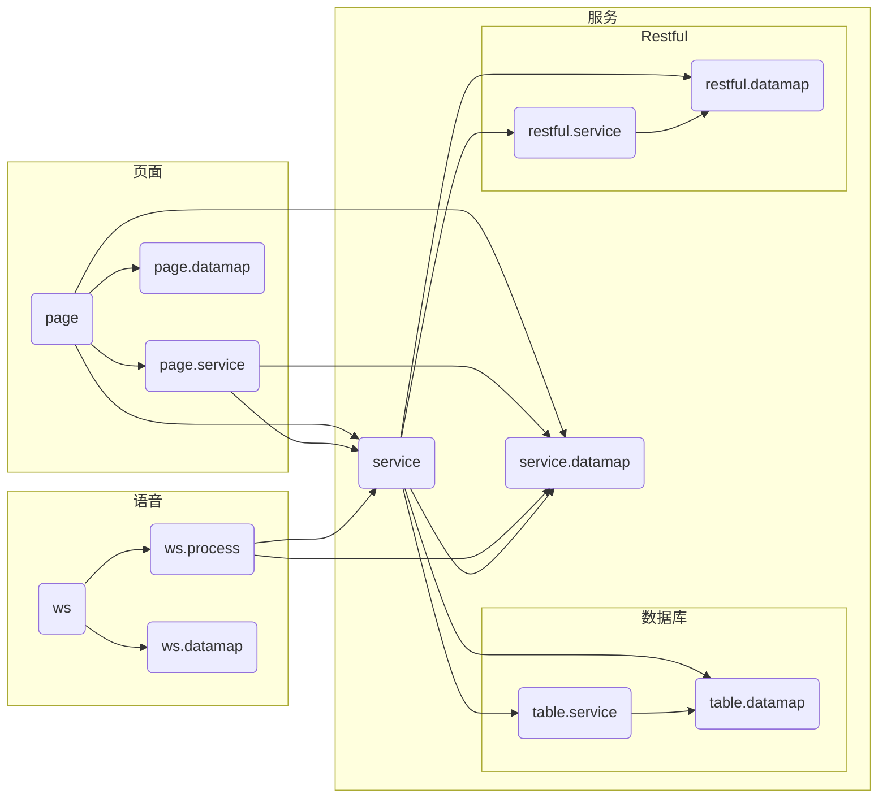

使用样例
```typescript
//table.datamap

export class EVTbl implements ITbl {
	evi: string;
	evn: string;
}

//service.datamap

export class EventData implements EVTbl {
	repeatType: RepeatEnum;
}

//page.datamap

export class PageEventData implements EventData {
	hasAddress: boolean = false;
}
```