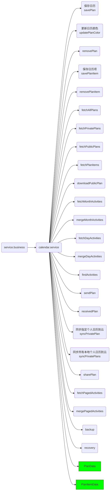

```mermaid
graph LR;
classDef datamap fill:#00ff00,stroke:#339911,stroke-width:2px;
A(service.business) --> B(calendar.service);
B --> B1(保存日历<br/>savePlan);
B --> B1-1(更新日历颜色<br/>updatePlanColor);
B --> B2(removePlan);
B --> B3(保存日历项<br/>savePlanItem);
B --> B4(removePlanItem);
B --> B5(fetchAllPlans);
B --> B6(fetchPrivatePlans);
B --> B7(fetchPublicPlans);
B --> B8(fetchPlanItems);
B --> B9(downloadPublicPlan);
B --> B10(fetchMonthActivities);
B --> B11(mergeMonthActivities);
B --> B12(fetchDayActivities);
B --> B13(mergeDayActivities);
B --> B14(findActivities);
B --> B15(sendPlan);
B --> B16(receivedPlan);
B --> B17(同步指定个人日历到云<br/>syncPrivatePlan);
B --> B18(同步所有本地个人日历到云<br/>syncPrivatePlans);
B --> B19(sharePlan);
B --> B20(fetchPagedActivities);
B --> B21(mergePagedActivities);
B --> B22(backup);
B --> B23(recovery);
B --> B99-1[PlanData];
B --> B99-2[PlanItemData];
class B99-1,B99-2 datamap;
```
