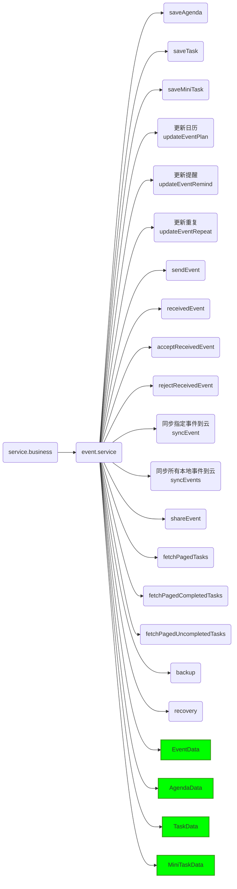

```mermaid
graph LR;
classDef datamap fill:#00ff00,stroke:#339911,stroke-width:2px;
A(service.business) --> C(event.service);
C --> C1(saveAgenda);
C --> C2(saveTask);
C --> C3(saveMiniTask);
C --> C1-1(更新日历<br/>updateEventPlan);
C --> C1-2(更新提醒<br/>updateEventRemind);
C --> C1-3(更新重复<br/>updateEventRepeat);
C --> C4(sendEvent);
C --> C5(receivedEvent);
C --> C5-1(acceptReceivedEvent);
C --> C5-2(rejectReceivedEvent);
C --> C6(同步指定事件到云<br/>syncEvent);
C --> C7(同步所有本地事件到云<br/>syncEvents);
C --> C8(shareEvent);
C --> C9(fetchPagedTasks);
C --> C91(fetchPagedCompletedTasks);
C --> C92(fetchPagedUncompletedTasks);
C --> C10(backup);
C --> C11(recovery);
C --> C99-1[EventData];
C --> C99-2[AgendaData];
C --> C99-3[TaskData];
C --> C99-4[MiniTaskData];
class C99-1,C99-2,C99-3,C99-4 datamap;
```
