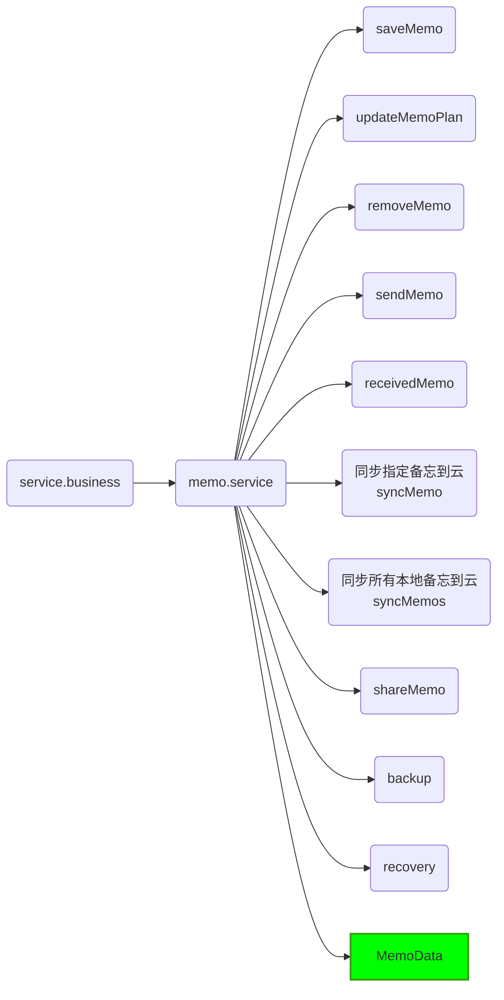

```mermaid
graph LR;
classDef datamap fill:#00ff00,stroke:#339911,stroke-width:2px;
A(service.business) --> D(memo.service);
D --> D1(saveMemo);
D --> D1-1(updateMemoPlan);
D --> D2(removeMemo);
D --> D3(sendMemo);
D --> D4(receivedMemo);
D --> D5(同步指定备忘到云<br/>syncMemo);
D --> D6(同步所有本地备忘到云<br/>syncMemos);
D --> D7(shareMemo);
D --> D8(backup);
D --> D9(recovery);
D --> D99-1[MemoData];
class D99-1 datamap;
```
