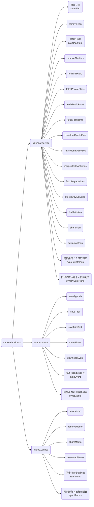

```mermaid
graph LR;
A(service.business) --> B(calendar.service);
B --> B1(保存日历<br/>savePlan);
B --> B2(removePlan);
B --> B3(保存日历项<br/>savePlanItem);
B --> B4(removePlanItem);
B --> B5(fetchAllPlans);
B --> B6(fetchPrivatePlans);
B --> B7(fetchPublicPlans);
B --> B8(fetchPlanItems);
B --> B9(downloadPublicPlan);
B --> B10(fetchMonthActivities);
B --> B11(mergeMonthActivities);
B --> B12(fetchDayActivities);
B --> B13(MergeDayActivities);
B --> B14(findActivities);
B --> B15(sharePlan);
B --> B16(downloadPlan);
B --> B17(同步指定个人日历到云<br/>syncPrivatePlan);
B --> B18(同步所有本地个人日历到云<br/>syncPrivatePlans);
A(service.business) --> C(event.service);
C --> C1(saveAgenda);
C --> C2(saveTask);
C --> C3(saveMiniTask);
C --> C4(shareEvent);
C --> C5(downloadEvent);
C --> C6(同步指定事件到云<br/>syncEvent);
C --> C7(同步所有本地事件到云<br/>syncEvents);
A(service.business) --> D(memo.service);
D --> D1(saveMemo);
D --> D2(removeMemo);
D --> D3(shareMemo);
D --> D4(downloadMemo);
D --> D5(同步指定备忘到云<br/>syncMemo);
D --> D6(同步所有本地备忘到云<br/>syncMemos);
```
