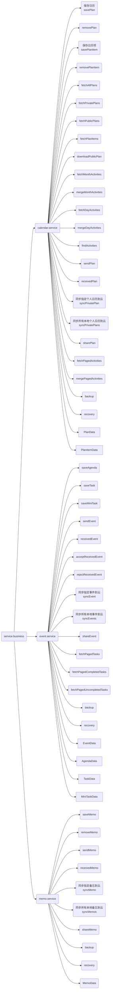

```mermaid
graph LR;
A(service.business) --> B(calendar.service);
B --> B1(保存日历<br/>savePlan);
B --> B2(removePlan);
B --> B3(保存日历项<br/>savePlanItem);
B --> B4(removePlanItem);
B --> B5(fetchAllPlans);
B --> B6(fetchPrivatePlans);
B --> B7(fetchPublicPlans);
B --> B8(fetchPlanItems);
B --> B9(downloadPublicPlan);
B --> B10(fetchMonthActivities);
B --> B11(mergeMonthActivities);
B --> B12(fetchDayActivities);
B --> B13(mergeDayActivities);
B --> B14(findActivities);
B --> B15(sendPlan);
B --> B16(receivedPlan);
B --> B17(同步指定个人日历到云<br/>syncPrivatePlan);
B --> B18(同步所有本地个人日历到云<br/>syncPrivatePlans);
B --> B19(sharePlan);
B --> B20(fetchPagedActivities);
B --> B21(mergePagedActivities);
B --> B22(backup);
B --> B23(recovery);
B --> B991[PlanData];
B --> B992[PlanItemData];
A(service.business) --> C(event.service);
C --> C1(saveAgenda);
C --> C2(saveTask);
C --> C3(saveMiniTask);
C --> C4(sendEvent);
C --> C5(receivedEvent);
C --> C51(acceptReceivedEvent);
C --> C52(rejectReceivedEvent);
C --> C6(同步指定事件到云<br/>syncEvent);
C --> C7(同步所有本地事件到云<br/>syncEvents);
C --> C8(shareEvent);
C --> C9(fetchPagedTasks);
C --> C91(fetchPagedCompletedTasks);
C --> C92(fetchPagedUncompletedTasks);
C --> C10(backup);
C --> C11(recovery);
C --> C991[EventData];
C --> C992[AgendaData];
C --> C993[TaskData];
C --> C994[MiniTaskData];
A(service.business) --> D(memo.service);
D --> D1(saveMemo);
D --> D2(removeMemo);
D --> D3(sendMemo);
D --> D4(receivedMemo);
D --> D5(同步指定备忘到云<br/>syncMemo);
D --> D6(同步所有本地备忘到云<br/>syncMemos);
D --> D7(shareMemo);
D --> D8(backup);
D --> D9(recovery);
D --> D991(MemoData);
```
