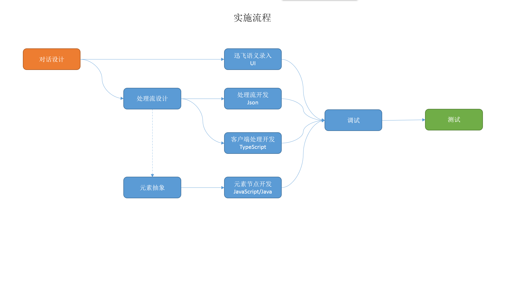
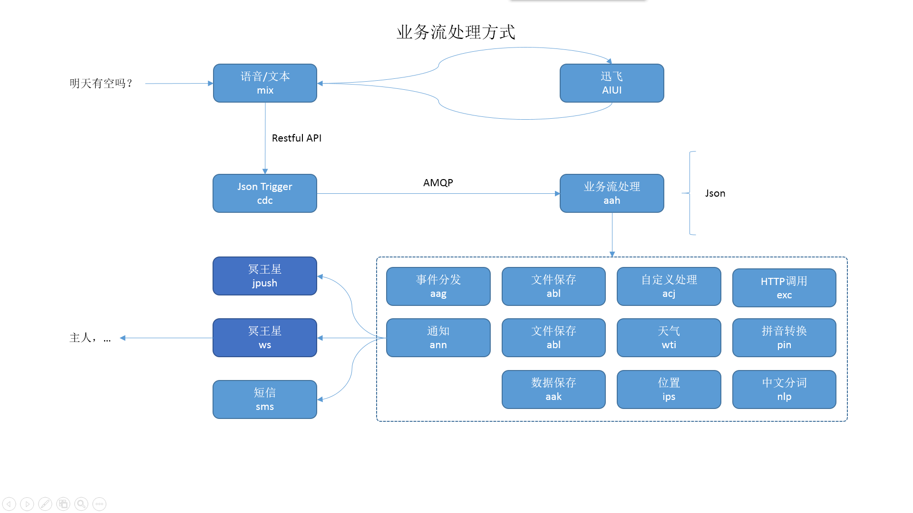
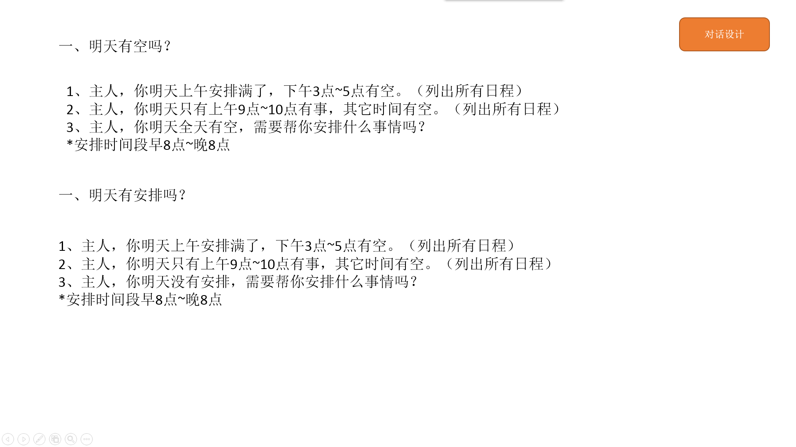
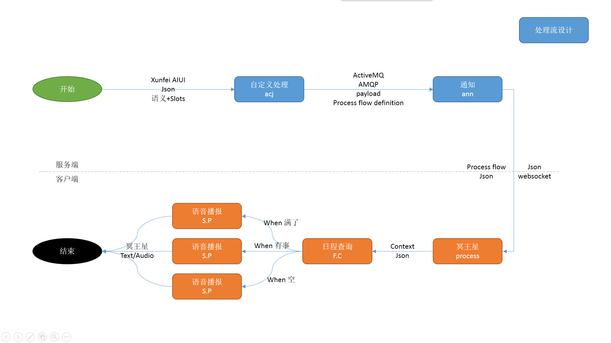

# 开发者参考文档

## 人工智能业务开发

## 样例（Examples）

### 讯飞技能开发
技能开发文档参考[讯飞技能开发文档][2]

#### 讯飞技能构成
技能 > 意图 > 语料

1. 技能
    1. 创建日程
        1. 意图
    2. 查询日程
        1. 意图
    3. 修改日程
        1. 意图
    4. 取消日程
        1. 意图
    5. 提醒
        1. 意图
    6. 黑名单
        1. 意图
    7. 确认操作
        1. 意图
    8. 使用帮助
        1. 意图
    9. 个性化参数设置
        1. 意图
    10. 可增加
        1. 意图

### 业务处理流 [aah][5]
[config/duan/aah/mwxing_inteligence_service_remote_start_v2.json][4]

### 逻辑处理

#### 自定义处理 [acj][1]
[config/duan/acj/v2][3]

#### 通知 [ann][7]
短信、极光推送和冥王星消息推送

#### 短链接 [sho][8]
互联网网络服务访问地址（URL）转换成短网址

#### 天气 [wti][9]
根据城市代码获取天气预报信息

#### ip定位城市 [ips][10]
根据客户端ip地址取得该ip所属城市

#### 中文分词 [nlp][11]
根据中文分词算法对输入中文句子进行短语、词性等分析

#### 中文拼音 [pin][13]
将输入中文转换成拼音

#### HTTP/HTTPS访问 [exc][12]
访问输入本地/互联网网络服务访问地址（URL），并返回服务返回结果，支持失败重试

### 事件分发 [aag][6]
定时事件（每小时整点, 每5分钟整点等事件）、GitHub Webhooks事件（push等）、fir.im Webhooks事件等

## 常用问题
1. 讯飞的结构咋用的，有说明文档不？
   参考[讯飞技能开发](#讯飞技能开发)

[1]: https://github.com/xiaoji-duan/duan-executor-dataprocessor "acj"
[2]: https://doc.iflyos.cn/studio/ "讯飞技能开发文档"
[3]: https://github.com/XJ-GTD/GTD2/tree/cassiscornuta/config/duan/acj/v2 "自定义逻辑处理样例"
[4]: https://github.com/XJ-GTD/GTD2/blob/cassiscornuta/config/duan/aah/mwxing_inteligence_service_remote_start_v2.json "通用语音业务处理流样例"
[5]: https://github.com/xiaoji-duan/duan-jobflows "aah"
[6]: https://github.com/xiaoji-duan/duan-eventdispacher "aag"
[7]: https://github.com/xiaoji-duan/duan-executor-announce "ann"
[8]: https://github.com/xiaoji-duan/duan-executor-shorturl "sho"
[9]: https://github.com/xiaoji-duan/duan-executor-weather "wti"
[10]: https://github.com/xiaoji-duan/duan-executor-ip2location "ips"
[11]: https://github.com/xiaoji-duan/duan-executor-nlp "nlp"
[12]: https://github.com/xiaoji-duan/duan-executor-http "exc"
[13]: https://github.com/xiaoji-duan/duan-executor-pinyin "pin"
