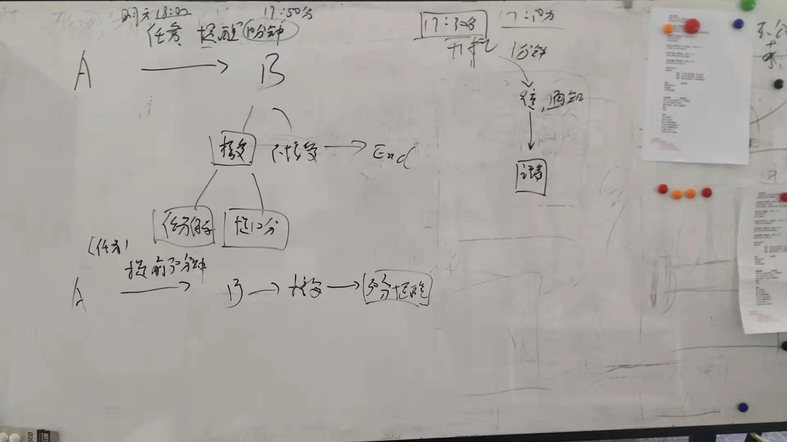

# 改进需求与开发规划
本次改进目标使冥王星可以真正的被用户使用起来，至少满足本团队成员日常生活中涉及到的日历、任务和备忘的需求。

## 改进需求
针对目前冥王星的功能以及概念定义上的改进

1. 日历、任务和备忘的概念定义

    目前版本的冥王星只定义了日程的概念，体现在用户新创建的日程，以及从系统日历下载的日历内容都存储在日程表中，没有进行区分。

    以下是本次改进对日历、任务和备忘的定义

    |     | 日历[1](#note-calendar-object) | 日程[2](#note-task-object) | 任务[2](#note-task-object) | 小任务[2](#note-task-object) | 备忘事[3](#note-memo-object) | 备忘信息[3](#note-memo-object) |
    | --- | :----: | :----: | :----: | :----: | :----: | :----: |
    | 提醒 | 是 | 是 | 是 | 是 | 无 | 无 |
    | 事后提醒 | 否 | 否 | 是 | 否 | 无 | 无 |
    | 要求确认 | 否 | 是 | 是 | 否 | ~~是[Q1](#note-question-1)~~ 无 | 无 |
    | 时间维度 | 开始 | 开始 | 开始+结束 | 无 | 当前时间 | 无 |
    | 状态 | 无 | 时间过后无 | 结束后无 | 提醒过后无 | 无 | 无 |
    | 分享 | 是 | 是 | 是 | 无 | 无[Q4](#note-question-4) | 无[Q4](#note-question-4) |
    | 邀请 | 无 | 是 | 是 | 无 | 无 | 无 |
    | 具体信息 | 无 | 有 | 有 | 无 | 无 | 无 |

    <a name="note-calendar-object">1. 日历</a>: 具备日期、名称的对象为日历对象，例如：农历节气中的"2019年7月23日 大暑"是日历对象，日历由多个对象组成，并赋予名称

    <a name="note-task-object">2. 任务</a>: 任务分为日程、任务和小任务

    <a name="note-memo-object">3. 备忘</a>: 备忘分为事和信息，例如：通过语音记录的借钱/还钱记录到备忘事中，不同日期的多次记录保存到同一条备忘中

2. 用户意图与入口

    冥王星支持传统意义上的日程、任务和备忘三种内容的管理, 这三种内容管理的出发点和使用目的是不同的

    1. <a name="task-anchor-16">日程</a>

        用户为了记录已经发生和未来将发生的事件 
        *例如：记录宝宝的成长日记、个人的工作日志、加班记录、课程表、倒班计划、学习计划、客户、朋友、或家人的生日、结婚纪念日等等已经发生或者还未发生但是不需要时刻提醒自己要去完成的事件*

        在这种情况下打开冥王星, 用户希望看到的是日历格式的页面, 可以通过日历去添加、查找和修改相关的事件

    2. <a name="task-anchor-17">任务</a>

        用户为了记录还未发生但是需要及时提醒自己去完成或者去跟进的事件 
        *例如：吃药、约会、结婚纪念日给老婆买花和礼物、完成冥王星改进需求开发计划、去招商银行办理公积金代缴申请手续等等*

        在这种情况下打开冥王星, 用户希望看到的是目前为止未完成的任务的页面, 可以快速操作完成任务、查看未来要完成的任务、创建和修改任务内容

    3. <a name="task-anchor-18">备忘</a>

        用户为了记录当前已经获得未来可能需要使用的信息, 未来需要的时候可以方便的找到 
        *例如：极光推送帐号和密码、托福考试申请网站用户名和密码、某次托福考试申请的准考证、大学学位证放在什么地方、驾驶证照片、与他人互相借还款信息等等*

        在这种情况下打开冥王星, 用户希望看到的是逐条显示的所有备忘信息, 并通过现实的信息快速找到自己需要的内容, 打开后查看、复制、编辑或者发送给他人

    综合以上用户意图, 从使用频率上来看, 任务使用频率最高、日程次之、备忘最低, 但是, 任务不是所有人都喜欢或者希望使用的, 也就是说, 部分用户只希望用冥王星来管理日程和备忘内容, 很少使用任务, 这时, 选择日程主入口作为冥王星启动后第一个页面比较合适; 
    所以, 可以让用户选择第一个页面是使用目前的日历页面还是任务页面, 并在创建日程/任务的时候互相之间快速切换, 是尽量满足不同用户使用需求的一个途径; 
    为了让用户第一次使用的时候, 知道可以在两个不同的入口间进行设置, 需要在第一次登录后, 提供设置引导, 通过引导, 让用户了解冥王星提供了两种不同的模式可供选择, 同时, 也让更多的用户匹配到自己使用冥王星的意图。 
    同时, 设计合理的交互方式, 让用户可以很自然的进入到日程、任务和备忘的入口, 完成用户零碎的使用需求。 
    语音是一种方式, "打开日历", "打开任务", "打开备忘", 冥王星打开对应的页面, 供用户使用。

3. 通知与提醒

    由于手机厂商对安卓系统定制深度不同，导致应用在被关闭之后，本地的提醒无法准时提醒用户，现对通知和提醒做以下定义和实现方案

    1. 通知和提醒的概念定义

    *通知* 为无精确时效要求的信息传达，用户可以在发生前或者发生后再收到; *提醒* 为有精确时效要求的信息传达，用户只有在发生时收到。

    以下是冥王星中信息传达的具体分类

    | | 通知 | 提醒 |
    |-|:----:|:---:|
    |智能提醒 每日简报| 通知 | - |
    |智能提醒 极端气候警报| 通知 | - |
    |日历 生日提醒[Q5](#note-question-5)| 通知 | - |
    |日历 结婚纪念日提醒| 通知 | - |
    |日历 世界杯小组赛 A组 第一场比赛提醒| 通知 | - |
    |日程 接收邀请通知| 通知 | - |
    |日程 提前10分钟提醒| - | 提醒 |
    |任务 接收邀请通知| 通知 | - |
    |任务 提前10分钟提醒| - | 提醒 |
    |任务 事后提醒| 通知 | - |
    |小任务 提前10分钟提醒| - | 提醒 |

    2. 正常过程 *一方或关联多方在事件发生时冥王星处于联机状态*

    用户B在接收到邀请后, 接受了邀请

    | | 时间线 | 用户A | 用户B | 处理逻辑 |
    |-|:-:|:---:|:---:|:-|
    |1|第一天 上午|创建日程 __*明天下午三点开项目总结会*__| |用户A本地+服务器端保存|
    |2|第一天 上午|设置 __*提前10分钟提醒*__| |用户A本地+服务器端保存|
    |3|第一天 上午|邀请 __*用户B*__ 参加| |用户A本地+服务器端保存, 发送通知和透传消息给用户B|
    |4|第一天 上午/下午||收到 __*用户A*__ __*明天下午三点开项目总结会*__ 通知|收到通知显示在系统通知栏上,  收到透传消息缓存日程到用户B本地|
    |5|第一天 上午/下午||接受邀请|用户B本地+服务器端保存|
    |6|第二天 上午|追加设置 __*提前30分钟提醒*__||用户A本地+服务器端保存,  发送透传消息给用户B,  用户B收到消息后, 用户B本地+服务器端保存|
    |7|第二天 下午两点半|收到 __*下午三点开项目总结会通知+提醒*__|收到 __*下午三点开项目总结会通知+提醒*__|服务端发送通知和透传消息给用户A和用户B (1分钟内接收有效),  两个客户端收到通知显示在系统通知栏上,  收到透传消息自动进行语音播报,  用户点击通知栏中的通知, 打开对应的日程画面|
    |8|第二天 下午两点五十分|收到 __*下午三点开项目总结会通知+提醒*__|收到 __*下午三点开项目总结会通知+提醒*__|同上|

    用户B在接收到邀请后, 拒绝了邀请

    | | 时间线 | 用户A | 用户B | 处理逻辑 |
    |-|:-:|:---:|:---:|:-|
    |1|第一天 上午|创建日程 __*明天下午三点开项目总结会*__| |用户A本地+服务器端保存|
    |2|第一天 上午|设置 __*提前10分钟提醒*__| |用户A本地+服务器端保存|
    |3|第一天 上午|邀请 __*用户B*__ 参加| |用户A本地+服务器端保存, 发送通知和透传消息给用户B|
    |4|第一天 上午/下午||收到 __*用户A*__ __*明天下午三点开项目总结会*__ 通知|收到通知显示在系统通知栏上,  收到透传消息缓存日程到用户B本地|
    |5|第一天 上午/下午||拒绝邀请|用户B本地删除缓存|
    |6|第二天 上午|追加设置 __*提前30分钟提醒*__||用户A本地+服务器端保存 ~~,  发送透传消息给用户B,  用户B收到消息后, 用户B本地+服务器端保存~~|
    |7|第二天 下午两点半|收到 __*下午三点开项目总结会通知+提醒*__|~~收到 __*下午三点开项目总结会通知+提醒*__~~|服务端发送通知和透传消息给用户A ~~和用户B~~ (1分钟内接收有效),  用户A客户端收到通知显示在系统通知栏上,  收到透传消息自动进行语音播报,  用户点击通知栏中的通知, 打开对应的日程画面|
    |8|第二天 下午两点五十分|收到 __*下午三点开项目总结会通知+提醒*__|~~收到 __*下午三点开项目总结会通知+提醒*__~~|同上|

    3. 异常过程 *一方或关联多方在部分事件发生时冥王星处于离线状态*

    用户B在第二天冥王星一直处于离线状态, 直到第三天上午才上线, 手机处于开机状态

    | | 时间线 | 用户A | 用户B | 处理逻辑 |
    |-|:-:|:---:|:---:|:-|
    |1|第一天 上午|创建日程 __*明天下午三点开项目总结会*__| |用户A本地+服务器端保存|
    |2|第一天 上午|设置 __*提前10分钟提醒*__| |用户A本地+服务器端保存|
    |3|第一天 上午|邀请 __*用户B*__ 参加| |用户A本地+服务器端保存, 发送通知和透传消息给用户B|
    |4|第一天 上午/下午||收到 __*用户A*__ __*明天下午三点开项目总结会*__ 通知|收到通知显示在系统通知栏上,  收到透传消息缓存日程到用户B本地|
    |5|第一天 上午/下午||接受邀请|用户B本地+服务器端保存|
    |6*|第二天 上午|追加设置 __*提前30分钟提醒*__||用户A本地+服务器端保存,  发送透传消息给用户B ~~,  用户B收到消息后, 用户B本地+服务器端保存~~ (该透传消息到下午两点半前有效)|
    |7*|第二天 下午两点半|收到 __*下午三点开项目总结会通知+提醒*__|收到 __*下午三点开项目总结会通知+提醒*__|服务端发送通知和透传消息给用户A和用户B (1分钟内接收有效),  两个客户端收到通知显示在系统通知栏上,  用户A收到透传消息自动进行语音播报,  用户B没有自动语音播报, 用户A点击通知栏中的通知, 打开对应的日程画面, 用户B没有打开通知|
    |8*|第二天 下午两点五十分|收到 __*下午三点开项目总结会通知+提醒*__|收到 __*下午三点开项目总结会通知+提醒*__|同上|
    |9*|第三天||打开冥王星, 并打开昨天 __*开项目总结会*__ 日程|日历首页不显示新消息提醒(红点), 日程页面不显示任何提醒设置项|

    用户B从第一天开始冥王星一直处于离线状态, 直到第三天上午才上线, 手机处于开机状态

    | | 时间线 | 用户A | 用户B | 处理逻辑 |
    |-|:-:|:---:|:---:|:-|
    |1|第一天 上午|创建日程 __*明天下午三点开项目总结会*__| |用户A本地+服务器端保存|
    |2|第一天 上午|设置 __*提前10分钟提醒*__| |用户A本地+服务器端保存|
    |3|第一天 上午|邀请 __*用户B*__ 参加| |用户A本地+服务器端保存, 发送通知和透传消息给用户B|
    |4|第一天 上午/下午||收到 __*用户A*__ __*明天下午三点开项目总结会*__ 通知|收到通知显示在系统通知栏上 ~~,  收到透传消息缓存日程到用户B本地~~|
    |5|第一天 上午/下午||~~接受邀请~~|~~用户B本地+服务器端保存~~|
    |6*|第二天 上午|追加设置 __*提前30分钟提醒*__||用户A本地+服务器端保存 ~~,  发送透传消息给用户B,  用户B收到消息后, 用户B本地+服务器端保存 (该透传消息到下午两点半前有效)~~|
    |7*|第二天 下午两点半|收到 __*下午三点开项目总结会通知+提醒*__|~~收到 __*下午三点开项目总结会通知+提醒*__~~|服务端发送通知和透传消息给用户A~~和用户B~~ (1分钟内接收有效),  用户A客户端收到通知显示在系统通知栏上,  用户A收到透传消息自动进行语音播报,  ~~用户B没有自动语音播报, ~~用户A点击通知栏中的通知, 打开对应的日程画面~~, 用户B没有打开通知~~|
    |8*|第二天 下午两点五十分|收到 __*下午三点开项目总结会通知+提醒*__|~~收到 __*下午三点开项目总结会通知+提醒*__~~|同上|
    |9*|第三天||打开冥王星[Q2](#note-question-2) ~~, 并打开昨天 __*开项目总结会*__ 日程~~|~~日历首页不显示新消息提醒(红点), 日程页面不显示任何提醒设置项~~|

    4. 添加提醒

        提醒只能在未来的日历项或者日程、任务和小任务上进行添加, 已过去的日历项或者日程、任务和小任务详情页面(如果有的话)中不再显示已经设定的提醒

        在创建过去时间的日历项或者日程的时候, 同样不显示提醒设定选项, 不能设定提醒

        提醒添加后, 提醒所在的日历项或者日程、任务和小任务保存到服务器, 由服务器准时发送通知和提醒到客户端进行提醒。

4. 邀请

    现有 *__发送__* 日程概念, 使用 *__邀请__* 概念替代, 邀请将支持两种模式, 一种即原有模式, 通过添加联系人方式邀请; 另外新增一种通过发送邀请页面, 由参与者通过邀请页面接受邀请。 
    邀请将支持两种__权限__, 一种即原有权限限制, 只有发起人可以修改日程内容, 并同步到所有参与人对应日程中, 下文称为"私有邀请/私有邀请日程"; 另外新增一种所有参与人都可以修改日程内容, 并同步到所有参与人对应日程中, 下文成为"公开邀请/公开邀请日程"。 
    邀请权限可以在邀请发起时选择, 默认为私有邀请。

    __再邀请__, 私有邀请日程只有发起人可以再邀请; 公开邀请日程任何人都可以再邀请[Q3](#note-question-3)。 
    __不保留日程__, 日程在邀请时, 可以选择不保留日程(即:一旦邀请成功, 发起人本地日程将自动删除, 发起人也将从日程参与人中移除), 默认为保留日程。

    邀请人未接受邀请前, 都视为不接受/拒绝。 
    邀请状态: 未发送、未送达、送达、接受、拒绝

    以下是邀请的处理逻辑

    1. <a name="task-anchor-14">邀请</a>

    通过添加联系人共享日程

    | | 用户A | 用户B | 处理逻辑 |
    |-|:---:|:---:|:---|
    |1|日程 __*7月28日 托福考试 考点宁波*__  页面选择邀请, 进入邀请页面,  选择默认权限(私有), 保留日程, 选择下一步,  进入联系人选择页面, 选择受邀人用户B, 选择确定||用户A本地+服务器端保存 本地受邀人状态"未送达" 服务器端发送通知和透传消息给用户B|
    |2||收到 __*用户A*__ __*7月28日 托福考试 考点宁波*__ 通知|收到通知显示在系统通知栏上,  收到透传消息缓存日程到用户B本地|
    |3||打开消息, 显示日程页面, 并弹出"邀请确认", 选择"接受"|加载缓存日程, 显示日程,  弹出"邀请确认"确认框; 接受: 用户B本地+服务器端保存 服务器端设置原日程对应受邀人"用户B"状态"接受" 发送通知和透传消息给用户A|
    |4|收到 __*用户B*__ __*7月28日 托福考试 考点宁波*__ 接受邀请 通知||收到透传消息更新对应日程受邀人"用户B"状态"接受"|

    2. <a name="task-anchor-15">页面邀请</a>

    通过分享邀请页面, 受邀人主动获取并加入共享日程

    | | 用户A | 用户B | 处理逻辑 |
    |-|:---:|:---:|:---|
    |1|日程 __*7月28日 托福考试 考点宁波*__  页面选择页面邀请, 进入邀请页面,  选择权限公开, 保留日程, 选择下一步, 分享到微信联系人||用户A本地+服务器端保存 无受邀人|
    |2||打开微信分享链接, 点击 __*\"在冥王星打开\"*__ 按钮,  冥王星启动, 显示日程页面,  并弹出"邀请确认", 选择"接受"|微信分享页面根据打开用户的手机类型,  使用iOS或者Android的应用跳转链接,  并附带日程ID参数。 冥王星启动后, 根据日程ID请求服务器获取日程信息, 缓存到用户B本地,  加载缓存日程, 显示日程,  弹出"邀请确认"确认框; 接受: 用户B本地+服务器端保存 服务器端设置原日程新增受邀人"用户B"状态"接受" 发送通知和透传消息给用户A|
    |3|收到 __*用户B*__ __*7月28日 托福考试 考点宁波*__ 接受邀请 通知||收到透传消息更新对应日程新增受邀人"用户B"状态"接受"|

    3. 不保留日程邀请

        邀请被任意受邀人接受后, 发起人退出并删除该日程, 不能选择私有权限

        1. 邀请

        通过添加联系人共享日程

        | | 用户A | 用户B | 处理逻辑 |
        |-|:---:|:---:|:---|
        |1|日程 __*7月28日 托福考试 考点宁波*__  页面选择邀请, 进入邀请页面,  只能选择公开权限, 不保留日程, 选择下一步,  进入联系人选择页面, 选择受邀人用户B, 选择确定||用户A本地+服务器端保存 本地受邀人状态"未送达" 服务器端发送通知和透传消息给用户B|
        |2||收到 __*用户A*__ __*7月28日 托福考试 考点宁波*__ 通知|收到通知显示在系统通知栏上,  收到透传消息缓存日程到用户B本地|
        |3||打开消息, 显示日程页面, 并弹出"邀请确认", 选择"接受"|加载缓存日程, 显示日程,  弹出"邀请确认"确认框; 接受: 用户B本地+服务器端保存 服务器端设置原日程对应受邀人"用户B"状态"接受" 发送通知和透传消息给用户A|
        |4|收到 __*用户B*__ __*7月28日 托福考试 考点宁波*__ 接受邀请 通知||收到透传消息更新对应日程受邀人"用户B"状态"接受",  上传服务器, 本地删除该日程[Q6](#note-question-6)|

        2. 页面邀请

        通过分享邀请页面, 受邀人主动获取并加入共享日程

        | | 用户A | 用户B | 处理逻辑 |
        |-|:---:|:---:|:---|
        |1|日程 __*7月28日 托福考试 考点宁波*__  页面选择页面邀请, 进入邀请页面,  选择权限公开, 不保留日程, 选择下一步, 分享到微信联系人||用户A本地+服务器端保存 无受邀人|
        |2||打开微信分享链接, 点击 __*\"在冥王星打开\"*__ 按钮,  冥王星启动, 显示日程页面,  并弹出"邀请确认", 选择"接受"|微信分享页面根据打开用户的手机类型,  使用iOS或者Android的应用跳转链接,  并附带日程ID参数。 冥王星启动后, 根据日程ID请求服务器获取日程信息, 缓存到用户B本地,  加载缓存日程, 显示日程,  弹出"邀请确认"确认框; 接受: 用户B本地+服务器端保存 服务器端设置原日程新增受邀人"用户B"状态"接受" 发送通知和透传消息给用户A|
        |3|收到 __*用户B*__ __*7月28日 托福考试 考点宁波*__ 接受邀请 通知||收到透传消息更新对应日程新增受邀人"用户B"状态"接受",  上传服务器, 本地删除该日程[Q6](#note-question-6)|

    4. 再邀请

        只有公开权限的受邀日程, 可以再邀请。日程菜单中可以选择邀请和页面邀请。

        1. 邀请

        通过添加联系人共享日程

        | | 用户A | 用户B | 用户C | 处理逻辑 |
        |-|:---:|:---:|:---:|:---|
        |1||受邀日程 __*7月28日 托福考试 考点宁波*__  页面选择邀请, 进入邀请页面,  权限公开(不能修改), 保留日程(不能修改), 选择下一步,  进入联系人选择页面, 选择受邀人用户C, 选择确定||用户B本地+服务器端保存 本地受邀人状态"未送达" 服务器端发送通知和透传消息给用户C, 发送通知和透传消息给用户A|
        |2|||收到 __*用户B*__ __*7月28日 托福考试 考点宁波*__ 通知|收到通知显示在系统通知栏上,  收到透传消息缓存日程到用户C本地|
        |3|收到 __*用户B*__ __*7月28日 托福考试 考点宁波*__ 邀请 __*用户B*__ 通知|||收到通知显示在系统通知栏上,  收到透传消息缓存日程到用户A本地|
        |4|||打开消息, 显示日程页面, 并弹出"邀请确认", 选择"接受"|加载缓存日程, 显示日程,  弹出"邀请确认"确认框; 接受: 用户C本地+服务器端保存 服务器端设置原日程对应受邀人"用户C"状态"接受" 发送通知和透传消息给用户B和用户A|
        |5|收到 __*用户C*__ __*7月28日 托福考试 考点宁波*__ 接受邀请 通知|收到 __*用户C*__ __*7月28日 托福考试 考点宁波*__ 接受邀请 通知||收到透传消息更新对应日程受邀人"用户C"状态"接受"|

        2. 页面邀请

        通过分享邀请页面, 受邀人主动获取并加入共享日程

        | | 用户A | 用户B | 用户C | 处理逻辑 |
        |-|:---:|:---:|:---|:---|
        |1||受邀日程 __*7月28日 托福考试 考点宁波*__  页面选择页面邀请, 进入邀请页面,  权限公开(不能修改), 保留日程(不能修改), 选择下一步, 分享到微信联系人|||用户B本地+服务器端保存 无新增受邀人|
        |2|||打开微信分享链接, 点击 __*\"在冥王星打开\"*__ 按钮,  冥王星启动, 显示日程页面,  并弹出"邀请确认", 选择"接受"|微信分享页面根据打开用户的手机类型,  使用iOS或者Android的应用跳转链接,  并附带日程ID参数。 冥王星启动后, 根据日程ID请求服务器获取日程信息, 缓存到用户C本地,  加载缓存日程, 显示日程,  弹出"邀请确认"确认框; 接受: 用户C本地+服务器端保存 服务器端设置原日程新增受邀人"用户C"状态"接受" 发送通知和透传消息给用户B和用户A|
        |3|收到 __*用户C*__ __*7月28日 托福考试 考点宁波*__ 接受邀请 通知|收到 __*用户C*__ __*7月28日 托福考试 考点宁波*__ 接受邀请 通知||收到透传消息更新对应日程新增受邀人"用户C"状态"接受"|

5. <a name="task-anchor-13">分享</a>

    新增日程第三方软件分享功能, 用于满足个人展示需求。 
    分享不限于自己创建的日程, 受邀请的日程也可以进行分享。 
    已分享的日程修改之后, 修改内容不反映到修改前分享的页面中, 重新分享将生成新的分享链接。

6. <a name="task-anchor-12">便捷操作</a>

    传统日历应用使用传统或者设计新颖的用户接口, 提供用户按照应用设计的要求录入内容, 新用户需要不断的适应应用对内容的录入要求, 不匹配用户的"人类工学"。

    冥王星希望通过人工智能, 从"人类工学"角度出发, 取消复杂的重复、提醒、备注、地址等设置页面, 使用和微信类似的语音和文字录入, 人工智能将用户录入的语音和文字, 提取和重复、提醒、备注、地址等相关的信息, 并格式化显示在日程详情页面中。

    相比复杂的各种功能菜单和功能按钮, 小小的手机屏幕无法一应装下, 通过语音/文字指令快捷打开, 将作为非主要操作功能的快捷入口。

    <a name="task-anchor-19">以下是冥王星已经支持或未来支持的语音指令和语音内容</a>

    ||指令/内容|功能|格式|支持版本|兼容性|
    |-|:---:|:---|:---|:---:|:---|
    |1|指令||把张金洋拉黑|^0.3.6|拉黑张金洋|
    |2|指令||打开语音唤醒|^0.3.6||
    |3|指令||打开音效|^0.3.6|打开震动 打开振动|
    |4|指令||打开新消息提醒|^0.3.6||
    |5|指令||打开日历|^0.3.7||
    |6|指令||打开任务|^0.3.7||
    |7|指令||打开备忘|^0.3.7||
    |8|内容|日程/任务 重复设置|每周三重复|^0.3.8||
    |9|内容|日程/任务 重复设置|到9月底为止|^0.3.8||
    |10|内容|日程/任务 地址设置|在北京喜玛拉雅酒店|^0.3.8||
    |11|内容|日程/任务 提醒设置|提前1天提醒我|^0.3.8||
    |12|内容|日程/任务 提醒设置|当天没有完成前每隔半个小时提醒一次|^0.3.8||
    |13|内容|日程/任务 备注设置|今天在喜玛拉雅酒店看到了老同学小明,  他变化很大, 差点没有认出来,  他告诉我上海他们组织了一个同学会,  每年会有1到2次活动, 到时候一起参加。|^0.3.8||
    |14|指令|日程/任务 显示倒计时|显示倒计时|^0.3.8|打开倒计时|
    |15|指令|日程/任务 邀请联系人|添加张金洋|^0.3.8|邀请张金洋|
    |16|指令|日程/任务 邀请联系人|把冥王星团队都拉进来|^0.3.8|邀请张金洋|
    |17|指令|日程/任务|打开邀请画面|^0.3.8|打开邀请|
    |18|指令|日程/任务|打开页面邀请画面|^0.3.8|打开页面邀请|

7. 技术难点

    现有版本用户使用过程中发现, 冥王星在不运行(即用户在手机打开应用中看不到冥王星)的状态下, 无法及时收到通知, 打开冥王星之后, 一下子收到很多通知; 语音在使用过程中不稳定, 具体表现在说过一句话之后要很久(超过5秒)才有回复, 或者干脆没有, 重新打开冥王星之后, 之前的语音回复又来了。

    1. <a name="task-anchor-1">通知及时性</a>

        经过调研, 使用极光推送(通过其它使用极光推送的app拉起冥王星进程, 达到离线接收通知的效果)可以在部分情况下, 冥王星不运行的状态下, 用户手机可以收到通知, 但是不能确保任何时候可以收到; 
        而极光推送集成的iOS设备的通知, 最终使用苹果公司的通知服务实现通知, 理论上可以达到任何时候可以收到的效果, 需要在真机环境下验证;

        为了使Android手机达到我们需要的效果, 需要集成多个手机厂商的推送服务, 目前考虑集成小米PUSH和华为推送服务, 小米PUSH还需要在真机环境下验证, 华为推送已经验证有效。

    2. <a name="task-anchor-2">语音响应速度与稳定性</a>

      目前实现方式是使用 __*百度语音*__ 进行语音听写, 并获得用户输入的音频文件, 上传 __*阿里云*__ 服务器, 阿里云服务器端调用讯飞AIUI接口, 获得讯飞语义解析结果, 然后调用 __*效吉软件*__ 公司服务器端不同的语义解析逻辑转换成客户端可识别的冥王星协议, 通过RabbitMQ发送给客户端。

      响应速度:

      1. 天气查询, 大部分响应在1.5秒以内, 个别情况超过5秒或者无响应。
      2. 日程查询, 大部分响应在1.5秒以内, 个别情况超过5秒或者无响应。

      问题判断:

      1. 语音消息和日程共享等共用同一个消息队列, 消息队列客户端执行消息按照顺序执行, 个别情况超过5秒可能是因为语音消息排在其它消息之后, 目前天气信息是通过消息队列每5分钟推送一次, 重新打开冥王星后, 消息队列中积压的消息会一下子推送到客户端, 导致语音消息被延后执行;
      2. 还有一种情况是, 客户端网络切换后, RabbitMQ还没有检测到客户端断开, 客户端重新连接后, RabbitMQ会产生两个客户端连接到同一个消息队列, 导致RabbitMQ推送的消息被推送到已经断开的客户端连街上, 导致新的连接无法收到该消息;
      3. 另外一种情况是, 客户端Sqlite查询效率低, 当用户创建了较多重复日程, 日程查询较慢, 根据实际测试较少日程的情况下查询时间在60毫秒左右, 当有较多重复日程的情况下查询时间一下子跳升到700毫秒以上。

      解决方案:

      1. 语音消息和其它消息分别通过不同的消息队列接收和处理, 互相不影响
      2. 网络断开重新连接后, 创建新的消息队列接收消息, 存在的问题是新的消息队列无法背压, 存储离线状态下未接收的消息, 语音消息不需要背压, 网络重连可以通知用户网络异常, 让用户知道因为网络问题冥王星无法处理他的语音请求。
      3. 优化客户端Sqlite查询效率, 或者使用缓存提高语音相应速度
      4. 使用讯飞语音听写接口, 可以省略语音上传过程, 缺点是讯飞将直接把语义解析结果返回给客户端, 语义解析后处理将只能由客户端自己完成。

## 修改点汇总
基于以上改进需求, 在现有版本基础上, 通过2周一次迭代的方式完成改进, 迭代计划和迭代内容汇总如下

||迭代时间|完成内容|状态|
|:---:|:---:|:---|:---:|
|1|2019年7月22日 \~ 2019年8月4日|1、提高通知及时性[Task1](#task-anchor-1)  2、语音响应速度与稳定性[Task2](#task-anchor-2)  3、支持语音场景一[Task3](#task-anchor-3)  4、支持语音场景二[Task4](#task-anchor-4)  5、支持语音场景三[Task5](#task-anchor-5)  6、支持语音场景四[Task6](#task-anchor-6)  7、支持语音场景五[Task7](#task-anchor-7)  8、支持语音场景六[Task8](#task-anchor-8)  9、支持语音场景七[Task9](#task-anchor-9)  10、支持语音场景八[Task10](#task-anchor-10)  11、支持语音场景九[Task11](#task-anchor-11)  |未开始|
|2|2019年8月5日 \~ 2019年8月18日|12、便捷操作[Task12](#task-anchor-12)  13、分享[Task13](#task-anchor-13)  14、邀请[Task14](#task-anchor-14)  15、页面邀请[Task15](#task-anchor-15)  16、日历页面改造[Task16](#task-anchor-16)  17、新增任务页面[Task17](#task-anchor-17)  18、新增备忘页面[Task18](#task-anchor-18)  |未开始|
|3|2019年8月19日 \~ 2019年9月1日|19、补充语音指令和内容[Task19](#task-anchor-19)  |未开始|
|4|2019年9月2日 \~ 2019年9月15日||未开始|

## 问题
<a name="note-question-1">1. 备忘事不能被邀请，怎么会有确认？</a>

~~待确认~~ 备忘不能推送(即邀请他人共享)给他人, 所以不存在确认

<a name="note-question-2">2. 如果第4步接收到的通知仍然存在于系统通知栏上, 这个时候用户再去点开通知, 页面应该如何显示？</a>

显示日程内容, 弹出已过期? 还是直接就进入日历画面, 不进入对应的日程画面(因为还没有选择是否接受, 而且这个日程已经过期)?

<a name="note-question-3">3. 这个和未来可能的应用场景"公开活动日程"不符</a>

这种场景下, 日程内容只能由发起者修改, 但是, 参与者可以自由再邀请。

<a name="note-question-4">4. 备忘内容有需求把内容发送给他人的需求</a>

备忘的备忘内容不能分享，无法满足把内容发送给他人的需求。 
例如：我备忘的阿里云密码内容，需要的时候，需要发送给你。

<a name="note-question-5">5. 类似生日提醒的日历项, 用户有增加提醒时间的需求, 需要准时送达</a>

用户增加的提醒时间行为视作小任务。 
在日历项相关显示页面增加添加提醒功能, 添加的提醒存储为小任务, 后续的提醒按照小任务提醒流程处理。

<a name="note-question-6">6. 不保留日程邀请, 如何提醒发起人删除日程交互设计待确认</a>

待确认

<a name="note-question-7">7. 在日历和任务中创建日程或任务日历和任务都显示</a>

创建使用同一个画面, 可选时间, 日程标题, 是否事后提醒

席理加(疑虑):  创建画面最好是分开, 日历进入的创建画面, 可选时间、日程标题, 并默认事后不提醒; 任务进入的创建画面只有日程标题, 并默认事后提醒; 事后提醒可以在日程详情画面修改。 这么做的原因是考虑用户在创建的时候, 看到很多选项, 特别是准备记录没有确定时间的任务时, 会很困惑, 而一般通过日历和任务画面进行创建操作的行为, 一般也是不一样的。

选择日历某个日期, 创建日程, 一般情况下都是在这个日期需要做, 或者在这个日期开始要做的事情;
选择在任务画面中, 创建任务, 一般情况下都是准备先把事情记录下来, 以后再确定时间或者直到做完了, 设置完成。

基于以上的考虑, 同意张金洋提出的不管在日历还是任务上创建的, 两边都显示, 但是, 使用同一个画面进行创建, 因为以上原因, 我不认可。

## 参考资料

### 19年7月 改进需求讨论记录一 *2019年7月17日* *张金洋* *席理加*

1. 图片记录

2. 补充说明

类似借钱这样的事情记录在备忘里面，记录在同一条记录里面，而不要显示在日程里面 
*(实现不能使用任务相关数据库表保存备忘记录)*

过去的日程，不能共享，不显示提醒，可以创建
任务只能创建未来的时间或者不指定时间

单独给别人的任务或日程，只提醒对方，画面可以选择只提醒对方或者也提醒自己
只让对方看到

分享和邀请，不考虑公开和私有，共享一个连接，点开后都能加入，不能再分享。
邀请时可选只有自己修改，所有人都可以修改，自己是否保留日程。
只有自己修改，别人不能再邀请，都有人都可以修改，别人都可以邀请。
不保留日程，只能选择都有人都可以修改

只有自己修改的模式不能改成所有人都可以修改，反之亦然
需要改变模式，重新创建
