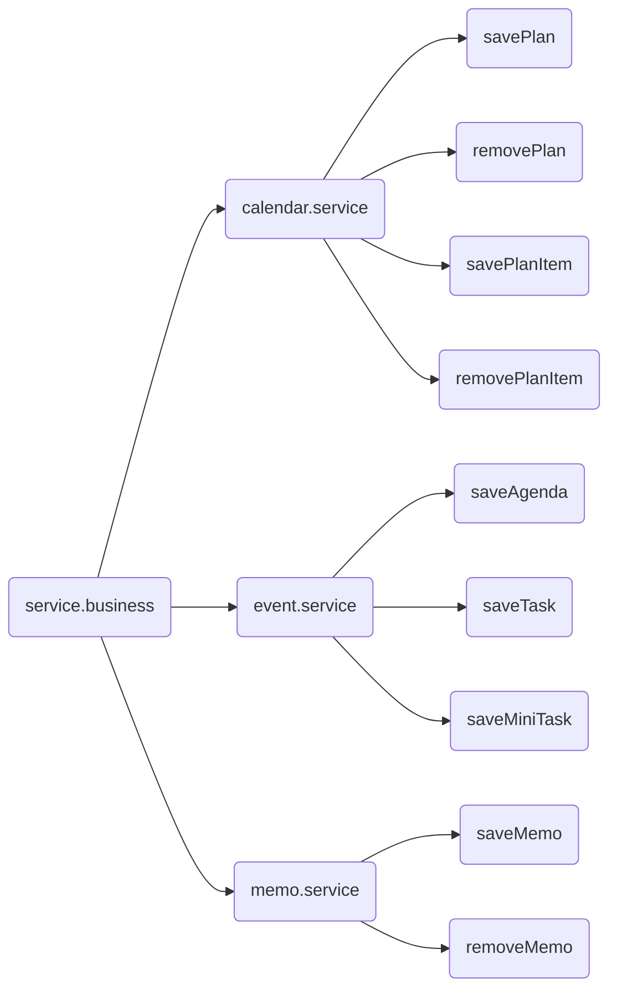

```mermaid
graph LR;
A(service.business) --> B(calendar.service);
B --> B1(savePlan);
B --> B2(removePlan);
B --> B3(savePlanItem);
B --> B4(removePlanItem);
A(service.business) --> C(event.service);
C --> C1(saveAgenda);
C --> C2(saveTask);
C --> C3(saveMiniTask);
A(service.business) --> D(memo.service);
D --> D1(saveMemo);
D --> D2(removeMemo);
```
